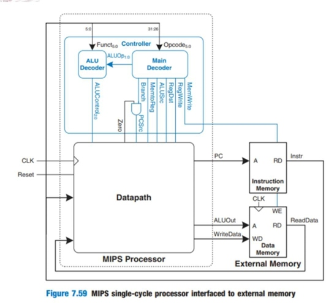
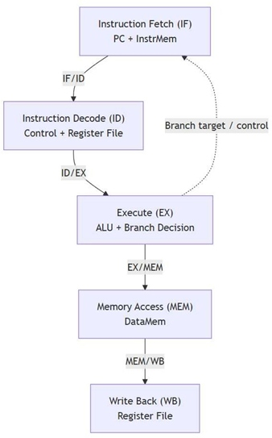
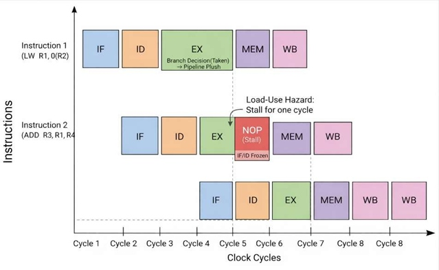
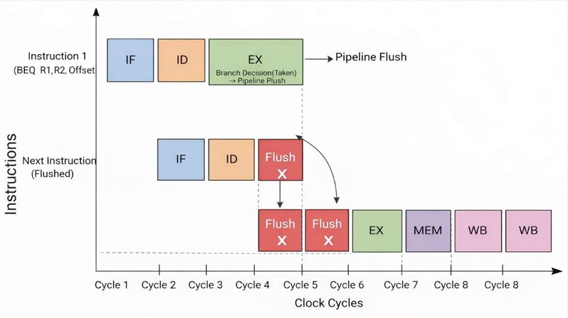
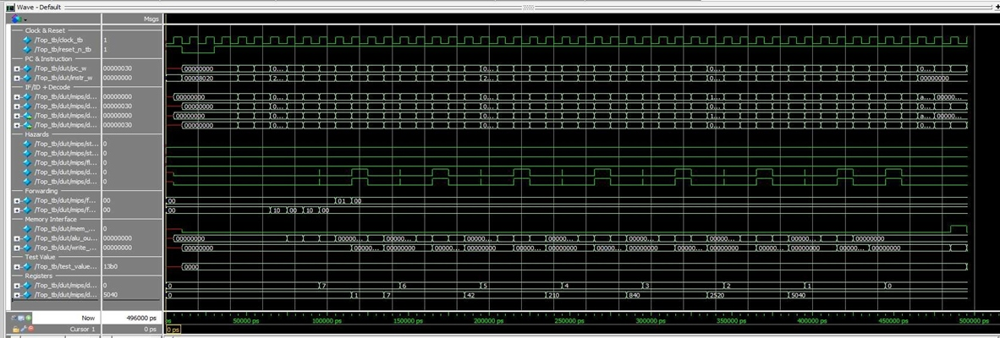
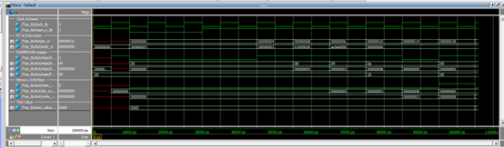
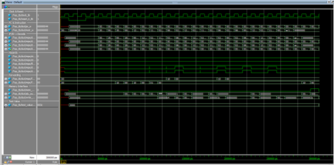

# 🚀 MIPS Processor: From Single-Cycle to 5-Stage Pipeline
### SystemVerilog Implementation | Computer Architecture Mini-Project 2026

> **Author:** Niv Toren  
> **Course:** Computer Architecture – 2026  
> **Tools:** ModelSim, SystemVerilog (IEEE 1800-2017)

---

## 📌 Project Overview

This project extends a baseline **32-bit Single-Cycle MIPS processor** into a fully functional **5-Stage Pipelined MIPS processor**, implementing classical hazard handling techniques to ensure correct execution.

The baseline Single-Cycle processor was originally designed by Mohamed Maged Elkholy (Alexandria University). The pipeline extension, hazard detection, forwarding logic, testbench, and verification infrastructure were independently designed and implemented by Niv Toren.

---

## 🏗️ Architecture

### Single-Cycle Baseline
In the original single-cycle design, every instruction completes in a single clock cycle. The clock period is dictated by the **longest instruction** (typically `LW` — Load Word).

<figure>
  
  <figcaption><em>Figure 7.59 – MIPS single-cycle processor interfaced to external memory (Harris & Harris)</em></figcaption>
</figure>

**Key limitations identified:**
- ⚠️ Long critical path → slow clock frequency
- ⚠️ Low hardware utilization → ALU idle during memory access
- ⚠️ No instruction-level parallelism

### 5-Stage Pipeline Extension

<figure>
  
  <figcaption><em>5-Stage pipeline datapath — IF → ID → EX → MEM → WB</em></figcaption>
</figure>

Pipeline registers between each stage (`IF/ID`, `ID/EX`, `EX/MEM`, `MEM/WB`) hold data and control signals, enabling multiple instructions to execute simultaneously.

---

## ⚡ Hazard Handling

### Data Hazards — Forwarding (Bypassing)
When an instruction depends on the result of a previous instruction still in the pipeline, **forwarding** routes the result directly from `EX/MEM` or `MEM/WB` back to the ALU inputs.

```
  ADD $t0, $t1, $t2   ──▶ EX stage (result available)
  SUB $t3, $t0, $t4   ──▶ needs $t0 ─────────────────▶ Forwarded ✅
```

### Load-Use Hazard — Stall

<figure>
  
  <figcaption><em>Load-Use hazard: 1 stall cycle inserted when LW is immediately followed by a dependent instruction</em></figcaption>
</figure>

When a `LW` is immediately followed by an instruction that uses the loaded value, the **Hazard Unit** inserts **one stall cycle** (NOP bubble in EX), freezing the `IF/ID` register.

### Control Hazards — Flush on Branch Taken

<figure>
  
  <figcaption><em>Branch flush: 2 pipeline stages flushed when BEQ/BNE is taken, resolved at EX stage</em></figcaption>
</figure>

Branch resolution occurs at the **EX stage**. If a branch is taken, the two instructions already fetched (in IF and ID) are flushed by inserting NOPs.

---

## 📁 File Structure

```
📦 MIPS-From-single-cycle-to-pipeline
 ┣ 📂 RTL (Design Files)
 ┃ ┣ 📄 Top.sv              — Top-level integration
 ┃ ┣ 📄 MIPS.sv             — Core: connects ControlUnit, DataPath, Hazard, Forwarding
 ┃ ┣ 📄 DataPath.sv         — 5-stage pipeline datapath
 ┃ ┣ 📄 PipelineReg.sv      — Generic pipeline register (with clear/enable)
 ┃ ┣ 📄 ControlUnit.sv      — Main decoder + ALU decoder
 ┃ ┣ 📄 HazardUnit.sv       — Load-use stall detection
 ┃ ┣ 📄 ForwardingUnit.sv   — EX/MEM/WB forwarding logic
 ┃ ┣ 📄 ALU.sv              — 32-bit ALU (ADD/SUB/AND/OR/SLT/...)
 ┃ ┣ 📄 CLA_Adder.sv        — Carry Look-Ahead Adder
 ┃ ┣ 📄 RegFile.sv          — 32×32 Register File (write-first bypass)
 ┃ ┣ 📄 DataMem.sv          — Data Memory (combinational read, clocked write)
 ┃ ┣ 📄 InstrMem.sv         — Instruction Memory (loads from .txt file)
 ┃ ┣ 📄 ResetSynchronizer.sv — Synchronous reset synchronizer
 ┃ ┣ 📄 MUX.sv              — Parameterized MUX
 ┃ ┣ 📄 Shifter.sv          — Shift unit
 ┃ ┣ 📄 SignExtn.sv         — Sign extension unit
 ┃ ┗ 📄 MainDec.sv / ALUDec.sv
 ┣ 📂 Verification
 ┃ ┣ 📄 Top_tb.sv           — Main testbench (assertions + PERF counters)
 ┃ ┣ 📄 run_all.do          — Compile & run all programs automatically
 ┃ ┣ 📄 prog1.txt           — Test: Basic arithmetic & memory write
 ┃ ┣ 📄 prog2.txt           — Test: GCD(120, 180) = 60
 ┃ ┣ 📄 prog3.txt           — Test: Factorial(7) = 5040
 ┃ ┗ 📄 prog4.txt           — Test: Store-data forwarding
 ┣ 📂 images                — Diagrams and waveform screenshots
 ┗ 📂 Documentation
   ┣ 📄 MIPS_MiniProject_Submission.pdf
   ┗ 📄 MIPS_MiniProject_Appendix.pdf
```

---

## ▶️ How to Run

### Prerequisites
- **ModelSim** (Intel/Aldec or Questa)
- All `.sv` and `.txt` files in the **same working directory**

### Quick Start
```tcl
# In ModelSim Transcript window:
do run_all.do
```

This will:
1. Clean and recompile all SystemVerilog files
2. Run all 4 test programs sequentially
3. Print PERF stats (cycles / stalls / flushes) for each
4. Save waveform files (`prog1.wlf` – `prog4.wlf`)
5. **Keep waves open** after each program for manual inspection

---

## 🖼️ Visual Verification

The project was validated not only by final memory values, but also through direct waveform inspection in ModelSim.
The screenshots included below demonstrate:

- Correct instruction flow across the 5 pipeline stages
- Branch-related flush behavior
- Correct final write-back / memory-write results
- Dedicated verification of store-data forwarding in `prog4`

### Example Waveform — prog3 (Factorial)

<figure>
  
  <figcaption><em>ModelSim waveform for <code>prog3</code> showing full pipeline activity during factorial execution. The trace ends with the correct final memory write <code>0x13B0</code>, after 45 cycles, 0 stalls, and 8 flushes.</em></figcaption>
</figure>

### Example Waveform — prog4 (Store-Data Forwarding)

<figure>
  
  <figcaption><em>Waveform showing the dedicated store-data forwarding scenario: ALU result is produced and immediately stored by the following instruction, resulting in <code>mem[0x00] = 0x00000008</code>.</em></figcaption>
</figure>

### Example Waveform — prog2 (GCD Branch Behavior)

<figure>
  
  <figcaption><em>Waveform highlighting iterative loop execution and control-flow behavior during the GCD program.</em></figcaption>
</figure>

---

## 📋 Expected Output

A successful run should print a `PERF` line and terminate with the expected final `test_value` for each program.

```
==========================================
Testing prog1 (Comprehensive Test)
Expected: Value 0x07 at address 0x54
==========================================
PERF: cycles=21 stalls=0 flushes=2
TB Finished. Final test_value = 0007 ✅
Prog1 finished. Waves are preserved for inspection.

==========================================
Testing prog2 (GCD of 120 and 180)
Expected: 0x3C (60 decimal) at address 0x00
==========================================
PERF: cycles=26 stalls=0 flushes=4
TB Finished. Final test_value = 003c ✅
Prog2 finished. Waves are preserved for inspection.

==========================================
Testing prog3 (Factorial of 7)
Expected: 0x13B0 (5040 decimal) at address 0x00
==========================================
PERF: cycles=45 stalls=0 flushes=8
TB Finished. Final test_value = 13b0 ✅
Prog3 finished. Waves are preserved for inspection.

==========================================
Testing prog4 (Store-Data Forwarding)
Expected: 0x08 (8 decimal) at address 0x00
==========================================
PERF: cycles=6 stalls=0 flushes=0
TB Finished. Final test_value = 0008 ✅
Prog4 finished. Waves are preserved for inspection.

==========================================
All program scripts completed.
==========================================
```

---

## 📊 Performance Analysis

| Program | Single-Cycle Cycles | Pipeline Cycles | Stalls | Flushes | Final Result |
|---------|-------------------|-----------------|--------|---------|-------------|
| Prog1 (Basic) | 16 | 21 | 0 | 2 | `mem[0x54] = 0x07` |
| Prog2 (GCD) | 18 | 26 | 0 | 4 | `mem[0x00] = 0x3C` |
| Prog3 (Factorial) | 34 | 45 | 0 | 8 | `mem[0x00] = 0x13B0` |
| Prog4 (Store-Data Forwarding) | — | 6 | 0 | 0 | `mem[0x00] = 0x08` |

`Prog4` was added as a dedicated verification case for store-data forwarding, validating that a value produced by one instruction can be immediately written to memory by the following `sw` instruction without an incorrect stale operand.

### Why does Pipeline have more cycles?

> **Pipeline wins in absolute time** if the clock period is reduced sufficiently.

For the pipeline to be faster in wall-clock time, the following condition must hold:

```
T_clk(Pipeline) / T_clk(Single) < Cycles(Single) / Cycles(Pipeline)
```

| Program | Ratio (Single/Pipeline) | Required T_clk reduction |
|---------|------------------------|--------------------------|
| Prog1 | 16/21 = 0.762 | > 24% |
| Prog2 | 18/26 = 0.692 | > 31% |
| Prog3 | 34/45 = 0.756 | > 25% |

A **25–31% reduction** in clock period is sufficient — realistic given each pipeline stage performs only ~1/5 of the total combinational work.

---

## ✅ Verification & Assertions

`Top_tb.sv` includes **4 runtime assertions** (gated by `reset_n_synch_w`):

| Assertion | What it checks |
|-----------|---------------|
| `ASSERT_ZERO` | `$zero` (reg[0]) remains 0 at all times |
| `ASSERT_LOAD_USE` | Load-use hazard always triggers stall_F + stall_D + flush_E |
| `ASSERT_FWD_VALID` | Forwarding selects are always valid (00/01/10) |
| `ASSERT_ALIGNMENT` | Memory writes are always word-aligned |

✅ All assertions passed across all 4 test programs with **zero violations**.  
✅ `Errors: 0, Warnings: 0` on full `run_all.do` execution.

Together, these assertions and the four test programs provide functional coverage for arithmetic execution, loop-based control flow, branch flushing, and store-data forwarding behavior.

---

## 🔮 Future Improvements

1. **Early Branch Resolution** — Move branch comparison to ID stage → reduce flush penalty from 2 to 1.
2. **Branch Prediction** — 1-bit or 2-bit predictor to reduce control hazard penalty.
3. **Advanced Control Hazard Handling** — Extend the design to support additional control-transfer instructions such as `jr`/`jalr` and reduce their penalty.
4. **Cache Layer** — Add instruction/data cache to simulate realistic memory latency.
5. **Superscalar Extension** — Dual-issue pipeline for further throughput improvement.

---

## 📚 References

- *Digital Design and Computer Architecture* — David Money Harris & Sarah L. Harris
- MIPS32 Architecture Reference Manual
- Original Single-Cycle baseline: Mohamed Maged Elkholy, Alexandria University

---

<div align="center">

**Niv Toren | 2026**

</div>
```

